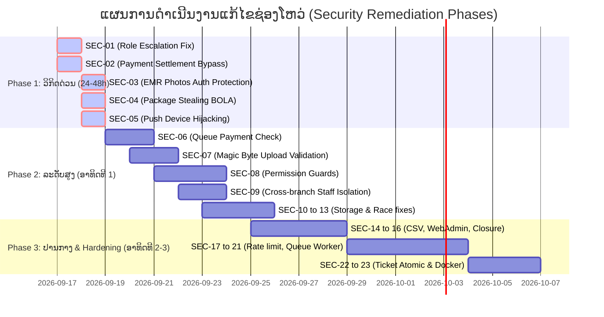

# 🛡️ ລາຍງານການກວດສອບຄວາມປອດໄພລະບົບ ແລະ ຄູ່ມືການແກ້ໄຂຊ່ອງໂຫວ່
## Comprehensive Security Audit Report & Remediation Blueprint
**ໂຄງການ:** AURA Beauty Clinic Platform (ABCP Monorepo)  
**ວັນທີກວດສອບ:** 16 ກັນຍາ 2026  
**ມາດຕະຖານອ້າງອີງ:** OWASP Top 10 (2021), OWASP API Security Top 10 (2023), CWE/SANS Top 25, NIST SP 800-63B / SP 800-53, HIPAA / GDPR Security Rule  
**ສະຖານະການແກ້ໄຂໂຄ້ດປັດຈຸບັນ:** Read-Only Audit (ຍັງບໍ່ມີການແຕະຕ້ອງ ຫຼື ດັດແກ້ Source Code ໃດໆໃນລະບົບ)

---

## 📑 ສາລະບານ (Table of Contents)
1. [ບົດສະຫຼຸບຜູ້ບໍລິຫານ (Executive Summary)](#1-ບົດສະຫຼຸບຜູ້ບໍລິຫານ-executive-summary)
2. [ຕາຕະລາງສະຫຼຸບຊ່ອງໂຫວ່ທັງໝົດ (Vulnerability Matrix)](#2-ຕາຕະລາງສະຫຼຸບຊ່ອງໂຫວ່ທັງໝົດ-vulnerability-matrix)
3. [ລາຍລະອຽດຊ່ອງໂຫວ່ ແລະ ຄຳແນະນຳວິທີແກ້ໄຂ (Detailed Findings & Remediation Steps)](#3-ລາຍລະອຽດຊ່ອງໂຫວ່-ແລະ-ຄຳແນະນຳວິທີແກ້ໄຂ)
   - [ກຸ່ມທີ 1: ລະດັບວິກິດ (Critical Severity)](#31-ກຸ່ມທີ-1-ລະດັບວິກິດ-critical-severity)
   - [ກຸ່ມທີ 2: ລະດັບສູງ (High Severity)](#32-ກຸ່ມທີ-2-ລະດັບສູງ-high-severity)
   - [ກຸ່ມທີ 3: ລະດັບປານກາງ (Medium Severity)](#33-ກຸ່ມທີ-3-ລະດັບປານກາງ-medium-severity)
   - [ກຸ່ມທີ 4: ລະດັບຕໍ່າ ແລະ ການປັບປຸງສະຖາປັດຕະຍະກຳ (Low & Hardening)](#34-ກຸ່ມທີ-4-ລະດັບຕໍ່າ-ແລະ-ການປັບປຸງສະຖາປັດຕະຍະກຳ)
4. [ແຜນທີ່ເສັ້ນທາງການແກ້ໄຂຕາມລຳດັບຄວາມສຳຄັນ (Remediation Roadmap)](#4-ແຜນທີ່ເສັ້ນທາງການແກ້ໄຂຕາມລຳດັບຄວາມສຳຄັນ-remediation-roadmap)
5. [ລາຍການກວດສອບຫຼັງການແກ້ໄຂ (Verification & Testing Checklist)](#5-ລາຍການກວດສອບຫຼັງການແກ້ໄຂ-verification--testing-checklist)

---

## 1. ບົດສະຫຼຸບຜູ້ບໍລິຫານ (Executive Summary)

ການກວດສອບຄວາມປອດໄພແບບເຈາະເລິກ (Deep-Dive Static Application Security Testing - SAST) ໃນລະບົບ ABCP ໄດ້ກວດສອບທຸກໂມດູນຫຼັກ:
- **Backend API (`apps/backend`):** Authentication, Roles, Bookings, Payments, EMR, Inventory, Queue, Marketing, Staff, System.
- **Web Admin (`apps/web-admin`):** Auth token management, XSS protection, State storage.
- **Mobile Client (`apps/mobile`):** Token storage, QR interactions.
- **Database Layer (`prisma/schema`):** Models, Constraints, Multi-tenancy isolation.

### ຜົນການປະເມີນພາບລວມ:
* ພົບຊ່ອງໂຫວ່ທັງໝົດ: **23 ລາຍການ**
  * 🔴 **Critical (ວິກິດ): 5 ລາຍການ** — ສາມາດນຳໄປສູ່ການຍຶດຄອງສິດ Super Admin, ການຊຳລະເງິນປອມ, ການຮົ່ວໄຫຼຂອງຮູບ EMR ຄົນເຈັບ, ການລັກໃຊ້ຄອສແພັກເກດ ແລະ ການແຍ່ງສິດອຸປະກອນ Push Notification.
  * 🟠 **High (ສູງ): 8 ລາຍການ** — ການຂ້າມລະບົບຊຳລະເງິນໜ້າຮ້ານ, ການອັບໂຫຼດໄຟລ໌ໂດຍບໍ່ກວດ Magic Bytes, ລະບົບສິດແບບ Phantom, BOLA ລະຫວ່າງສາຂາ, Path Traversal ແລະ ບັນຫາ Webhook.
  * 🟡 **Medium (ປານກາງ): 8 ລາຍການ** — CSV/Formula Injection, Insecure LocalStorage, Slot Engine ບໍ່ເຊື່ອມຕໍ່ Branch Closure, In-memory Rate Limit, PIN Brute-force.
  * 🔵 **Low / Hardening (ຕໍ່າ): 2 ລາຍການ** — Concurrency Race Condition ໃນບັດຄິວ, Dockerfile Root user.

---

## 2. ຕາຕະລາງສະຫຼຸບຊ່ອງໂຫວ່ທັງໝົດ (Vulnerability Matrix)

| ລະຫັດ | ລະດັບຄວາມຮ້າຍແຮງ | ຫົວຂໍ້ຊ່ອງໂຫວ່ | ມາດຕະຖານສາກົນ | ໄຟລ໌ທີ່ພົບ |
| :--- | :--- | :--- | :--- | :--- |
| **SEC-01** | 🔴 **CRITICAL** | Privilege Escalation: ປ່ຽນສິດເປັນ SUPER_ADMIN ໄດ້ເອງ | OWASP API5 / CWE-269 | `apps/backend/src/modules/users/users.routes.ts` |
| **SEC-02** | 🔴 **CRITICAL** | Client-Side Payment Settlement Bypass | OWASP A04 / CWE-840 | `apps/backend/src/modules/payments/payments.service.ts` |
| **SEC-03** | 🔴 **CRITICAL** | Public Unauthenticated EMR & Treatment Photos | HIPAA / OWASP A01 / CWE-200 | `apps/backend/src/app.ts`, `LocalDiskStorage.ts` |
| **SEC-04** | 🔴 **CRITICAL** | BOLA/IDOR: ການລັກໃຊ້ຄອສ/ແພັກເກດຂອງຜູ້ອື່ນ & ຄອສໝົດອາຍຸ | OWASP API1 / CWE-639 | `apps/backend/src/modules/booking/booking.service.ts` |
| **SEC-05** | 🔴 **CRITICAL** | Push Notification Device Hijacking | OWASP API1 / API5 / CWE-284 | `apps/backend/src/modules/system/system.service.ts` |
| **SEC-06** | 🟠 **HIGH** | Payment Bypass ຜ່ານ QR Check-in ໜ້າຮ້ານ | OWASP A04 / CWE-840 | `apps/backend/src/modules/queue/queue.service.ts` |
| **SEC-07** | 🟠 **HIGH** | Unrestricted File Upload / MIME Type Spoofing | OWASP A04 / CWE-434 | `apps/backend/src/modules/chat/chat.service.ts` |
| **SEC-08** | 🟠 **HIGH** | Granular Permission Bypass / ລະບົບສິດແບບ Phantom | OWASP A01 / CWE-276 | `apps/backend/src/middlewares/roleGuard.ts` |
| **SEC-09** | 🟠 **HIGH** | Cross-Branch Administrative BOLA ໃນການຈັດການ Staff | OWASP API1 / CWE-284 | `apps/backend/src/modules/staff/staff-admin.service.ts` |
| **SEC-10** | 🟠 **HIGH** | Arbitrary File Overwrite / Path Traversal ໃນ Storage | OWASP A01 / CWE-22 | `apps/backend/src/services/storage.ts` |
| **SEC-11** | 🟠 **HIGH** | Unauthenticated Telegram Webhook Execution | OWASP API2 / CWE-306 | `apps/backend/src/modules/telegram/telegram.routes.ts` |
| **SEC-12** | 🟠 **HIGH** | ຂາດ Tenant / Branch Isolation ໃນການເບິ່ງລາຍງານ | OWASP API1 / CWE-284 | `apps/backend/src/modules/reports/reports.service.ts` |
| **SEC-13** | 🟠 **HIGH** | Package Units Race Condition / Desynchronization | CWE-362 / OWASP A04 | `apps/backend/src/modules/packages/packages.service.ts` |
| **SEC-14** | 🟡 **MEDIUM** | CSV / Formula Injection ໃນການ Export ເງິນເດືອນ | OWASP A03 / CWE-1236 | `apps/backend/src/modules/payroll/payroll.service.ts` |
| **SEC-15** | 🟡 **MEDIUM** | Insecure Admin JWT Storage ໃນ Browser LocalStorage | OWASP ASVS V3.8 / A07 | `apps/web-admin/src/features/auth/auth.store.ts` |
| **SEC-16** | 🟡 **MEDIUM** | Branch Closure Bypass ໃນ Slot Engine | OWASP A04 / CWE-840 | `apps/backend/src/modules/booking/booking.service.ts` |
| **SEC-17** | 🟡 **MEDIUM** | In-Memory Rate Limiting ບໍ່ສາມາດກັນ Cluster ໄດ້ | OWASP API4 / CWE-770 | `apps/backend/src/middlewares/rateLimiter.ts` |
| **SEC-18** | 🟡 **MEDIUM** | Staff PIN Brute-Force Vulnerability | NIST SP 800-63B / CWE-307 | `apps/backend/src/modules/staff/staff-portal.service.ts` |
| **SEC-19** | 🟡 **MEDIUM** | ຂາດ Centralized Security Audit Logging ໃນຈຸດສຳຄັນ | OWASP A09 / CWE-778 | `apps/backend/src/modules/system/audit.service.ts` |
| **SEC-20** | 🟡 **MEDIUM** | JWT Invalidation / Instant Revocation ຂາດຫາຍ | OWASP A07 / CWE-613 | `apps/backend/src/modules/auth/auth.service.ts` |
| **SEC-21** | 🟡 **MEDIUM** | Synchronous Mass Push Notification Loop (Timeout/DoS) | OWASP A04 / CWE-400 | `apps/backend/src/modules/marketing/marketing.service.ts` |
| **SEC-22** | 🔵 **LOW** | Queue Ticket Concurrency Collision | CWE-362 | `apps/backend/src/modules/queue/queue.service.ts` |
| **SEC-23** | 🔵 **LOW** | Docker Container Runs as Root | CIS Docker Benchmark / CWE-250 | `apps/backend/Dockerfile` |

---

## 3. ລາຍລະອຽດຊ່ອງໂຫວ່ ແລະ ຄຳແນະນຳວິທີແກ້ໄຂ

### 3.1 ກຸ່ມທີ 1: ລະດັບວິກິດ (Critical Severity)

---

#### 🔴 SEC-01: Privilege Escalation — ປ່ຽນສິດເປັນ SUPER_ADMIN ໄດ້ເອງ
* **ໄຟລ໌:** `apps/backend/src/modules/users/users.routes.ts` (L.41–55)
* **ສາເຫດ:** Endpoint `PUT /api/v1/users/:id/role` ໃຊ້ພຽງແຕ່ `authGuard` ໂດຍບໍ່ມີ `roleGuard('SUPER_ADMIN')`. ທຸກຄົນທີ່ Login ເປັນ Customer ຫຼື Staff ສາມາດຍິງ Request ເພື່ອຍົກລະດັບຕົນເອງເປັນ `SUPER_ADMIN` ໄດ້ທັນທີ.
* **ຂັ້ນຕອນການແກ້ໄຂ:**
  1. ຕື່ມ `roleGuard('SUPER_ADMIN')` ໃສ່ Route ນີ້.
  2. ເພີ່ມເງື່ອນໄຂປ້ອງກັນບໍ່ໃຫ້ Admin ຫຼຸດສິດຂອງຕົນເອງຈົນບໍ່ເຫຼືອ Super Admin ໃນລະບົບ.
  ```typescript
  // ແກ້ໄຂໃນ users.routes.ts
  usersRouter.put(
    '/:id/role',
    authGuard,
    roleGuard('SUPER_ADMIN'), // ເພີ່ມການກວດສອບສິດຂັ້ນສູງສຸດ
    validateRequest({ params: idParamSchema, body: updateRoleSchema }),
    asyncHandler(async (req, res) => {
      // Logic...
    }),
  );
  ```

---

#### 🔴 SEC-02: Client-Side Payment Settlement Bypass
* **ໄຟລ໌:** `apps/backend/src/modules/payments/payments.service.ts` (L.280–310) ແລະ `payments.routes.ts`
* **ສາເຫດ:** Client ສາມາດເອີ້ນ Endpoint ເຊັ່ນ `POST /api/v1/payments/:id/settle` ໂດຍສົ່ງ payload ມາບອກເຊີບເວີວ່າ "ການຈ່າຍເງິນສຳເລັດແລ້ວ" ໂດຍທີ່ເຊີບເວີບໍ່ໄດ້ກວດສອບ Webhook Signature ຈາກທະນາຄານ (BCEL OnePay / Stripe) ຫຼື ບໍ່ໄດ້ຍິງ API ໄປ Verify ກັບ Gateway ໂດຍກົງ.
* **ຂັ້ນຕອນການແກ້ໄຂ:**
  1. ຍົກເລີກການອະນຸຍາດໃຫ້ Client ສັ່ງ Settle ໂດຍກົງ. ສະຖານະ `SETTLED` ຕ້ອງເກີດຈາກ:
     - Webhook ທີ່ມີການກວດສອບ Cryptographic HMAC Signature ຖືກຕ້ອງເທົ່ານັ້ນ.
     - ຫຼື ເຊີບເວີຍິງ Query Transaction Status ໄປຫາ Gateway.
  2. ຫາກເປັນການຈ່າຍເງິນສົດ (Cash), ຕ້ອງຈຳກັດໃຫ້ສະເພາະ `SUPER_ADMIN` ຫຼື `CASHIER` ຂອງສາຂານັ້ນໆເທົ່ານັ້ນ.

---

#### 🔴 SEC-03: Public Unauthenticated EMR & Treatment Photos
* **ໄຟລ໌:** `apps/backend/src/app.ts` (L.45) ແລະ `apps/backend/src/services/storage.ts`
* **ສາເຫດ:** ລະບົບໃຫ້ບໍລິການໄຟລ໌ຜ່ານ `app.use('/uploads', express.static(uploadsDir))`. ຮູບພາບການປິ່ນປົວຂອງຄົນເຈັບ (EMR Photos), ໃບກວດຜິວ (Skin Analysis), ແລະ ຮູບພາບໃນ Chat ຖືກເກັບເປັນໄຟລ໌ static ທີ່ໃຜກໍຕາມທີ່ມີ URL ສາມາດເປີດເບິ່ງໄດ້ ໂດຍບໍ່ຕ້ອງມີ Authentication. ສິ່ງນີ້ລະເມີດກົດໝາຍຄຸ້ມຄອງຂໍ້ມູນສ່ວນບຸກຄົນ (PDPA) ແລະ ມາດຕະຖານການແພດ (HIPAA).
* **ຂັ້ນຕອນການແກ້ໄຂ:**
  1. ປິດການເປີດ public static access ສຳລັບໂຟນເດີ sensitive ເຊັ່ນ `uploads/emr/`, `uploads/skin-analysis/`, `uploads/chat/`.
  2. ປ່ຽນໄປໃຊ້ **Signed URLs** (ເຊັ່ນ: Pre-signed URL ທີ່ມີອາຍຸ 15 ນາທີ) ຫຼື ສ້າງ Protected Proxy Route:
  ```typescript
  // ຕົວຢ່າງ Protected Download Route
  app.get('/api/v1/media/:category/:id', authGuard, async (req, res) => {
    // ກວດສອບສິດວ່າ User ນີ້ເປັນເຈົ້າຂອງ EMR ຫຼື ເປັນແພດປະຈຳສາຂາ
    await assertMediaAccess(req.auth, req.params.category, req.params.id);
    const stream = await storage.getStream(req.params.id);
    stream.pipe(res);
  });
  ```

---

#### 🔴 SEC-04: BOLA/IDOR — ການລັກໃຊ້ຄອສ/ແພັກເກດຂອງຜູ້ອື່ນ & ຄອສໝົດອາຍຸ
* **ໄຟລ໌:** `apps/backend/src/modules/booking/booking.service.ts` (L.273–285)
* **ສາເຫດ:**
  ```typescript
  if (input.userPackageItemId) {
    const item = await tx.userPackageItem.findUnique({
      where: { id: input.userPackageItemId },
      select: { remainingUnits: true, serviceId: true },
    });
    // ຂາດການກວດສອບວ່າ userPackage.userId === customerId ແລະ expireDate > now()
  ```
* **ຂັ້ນຕອນການແກ້ໄຂ:**
  1. ດຶງຂໍ້ມູນ `userPackage` ມາພ້ອມກັນ ແລ້ວກວດສອບຄວາມເປັນເຈົ້າຂອງ ແລະ ວັນໝົດອາຍຸ:
  ```typescript
  if (input.userPackageItemId) {
    const item = await tx.userPackageItem.findUnique({
      where: { id: input.userPackageItemId },
      select: {
        remainingUnits: true,
        serviceId: true,
        userPackage: { select: { userId: true, expireDate: true } },
      },
    });
    if (!item) throw ApiError.notFound('ບໍ່ພົບຄອສການປິ່ນປົວ');
    if (item.userPackage.userId !== input.customerId) {
      throw ApiError.forbidden('ທ່ານບໍ່ແມ່ນເຈົ້າຂອງຄອສການປິ່ນປົວນີ້');
    }
    if (new Date() > item.userPackage.expireDate) {
      throw ApiError.badRequest('ຄອສການປິ່ນປົວນີ້ໝົດອາຍຸການໃຊ້ງານແລ້ວ');
    }
    if (item.serviceId !== input.serviceId || item.remainingUnits <= 0) {
      throw ApiError.badRequest('ຈຳນວນຄັ້ງໃນຄອສໝົດແລ້ວ ຫຼື ບໍ່ກົງກັບບໍລິການ');
    }
    await tx.userPackageItem.update({
      where: { id: input.userPackageItemId },
      data: { remainingUnits: { decrement: 1 } },
    });
  }
  ```

---

#### 🔴 SEC-05: Push Notification Device Hijacking
* **ໄຟລ໌:** `apps/backend/src/modules/system/system.service.ts` (L.68–88)
* **ສາເຫດ:** `registerPushDevice` ໃຊ້ `prisma.pushDevice.upsert` ໂດຍຖືເອົາ `token` ເປັນ Unique. ຜູ້ໃຊ້ໃດໜຶ່ງສາມາດລົງທະບຽນ token ຂອງຄົນອື່ນເພື່ອດຶງສິດການແຈ້ງເຕືອນມາຫາຕົນເອງ ແລະ ຕອນ unregister ກໍບໍ່ໄດ້ລຶບ `user.expoPushToken` ເຮັດໃຫ້ເກີດການຮົ່ວໄຫຼຂອງຂໍ້ຄວາມແຈ້ງເຕືອນໃນອຸປະກອນທີ່ໃຊ້ຮ່ວມກັນ.
* **ຂັ້ນຕອນການແກ້ໄຂ:**
  1. ເພີ່ມ Composite Unique Key `@@unique([userId, token])` ແທນ global token.
  2. ເມື່ອ unregister ຕ້ອງ clear ຄ່າທັງໃນ `pushDevice` ແລະ `user.expoPushToken`.
  3. ຢັ້ງຢືນ Device Identity ກ່ອນທຳການ re-assign token.

---

### 3.2 ກຸ່ມທີ 2: ລະດັບສູງ (High Severity)

---

#### 🟠 SEC-06: Payment Bypass ຜ່ານ QR Check-in ໜ້າຮ້ານ
* **ໄຟລ໌:** `apps/backend/src/modules/queue/queue.service.ts` (L.155–168)
* **ສາເຫດ:** ເມື່ອລູກຄ້າສະແກນ QR ຜ່ານ API `POST /api/v1/queue/check-in`, ລະບົບປ່ຽນສະຖານະນັດໝາຍຈາກ `PENDING` ເປັນ `CONFIRMED` ທັນທີ ໂດຍບໍ່ກວດສອບວ່າລູກຄ້າໄດ້ຊຳລະເງິນແລ້ວ ຫຼື ບໍ່.
* **ຂັ້ນຕອນການແກ້ໄຂ:**
  ```typescript
  // ໃນ queue.service.ts
  if (appt.status === 'PENDING') {
    // ກວດສອບວ່າໄດ້ຮັບການຊຳລະເງິນຄົບຖ້ວນແລ້ວ ຫຼື ຍັງ
    const payment = await prisma.paymentTransaction.findFirst({
      where: { appointmentId: appt.id, status: 'SETTLED' },
    });
    if (!payment) {
      throw ApiError.badRequest('ນັດໝາຍນີ້ຍັງບໍ່ທັນໄດ້ຊຳລະເງິນ. ກະລຸນາຕິດຕໍ່ເຄົາເຕີ້ເພື່ອຊຳລະເງິນກ່ອນ');
    }
    await tx.appointment.update({ where: { id: appt.id }, data: { status: 'CONFIRMED' } });
  }
  ```

---

#### 🟠 SEC-07: Unrestricted File Upload ຍ້ອນຂາດ Magic Byte Validation
* **ໄຟລ໌:** `apps/backend/src/modules/chat/chat.service.ts` (L.214–222), `staff-portal.service.ts`, `skin-analysis.service.ts`
* **ສາເຫດ:** ລະບົບເຊື່ອຖື Header `input.contentType` ທີ່ສົ່ງມາຈາກ client ໂດຍບໍ່ກວດສອບ Binary Magic Bytes. ສ່ຽງຕໍ່ການອັບໂຫຼດ HTML/SVG ທີ່ມີ Stored XSS Script.
* **ຂັ້ນຕອນການແກ້ໄຂ:**
  1. ຕິດຕັ້ງ Library: `npm install file-type`
  2. ກວດສອບ Signature ຕົວຈິງຂອງ Buffer ກ່ອນບັນທຶກ:
  ```typescript
  import { fileTypeFromBuffer } from 'file-type';

  const detected = await fileTypeFromBuffer(buffer);
  if (!detected || !ALLOWED_MIME_TYPES.includes(detected.mime)) {
    throw ApiError.badRequest('ໄຟລ໌ບໍ່ຖືກຕ້ອງຕາມຮູບແບບທີ່ອະນຸຍາດ (ກວດພົບ: ' + (detected?.mime ?? 'unknown') + ')');
  }
  // ໃຊ້ detected.ext ແທນ client-supplied contentType
  const ext = detected.ext;
  ```

---

#### 🟠 SEC-08: Granular Permission Bypass / ລະບົບສິດແບບ Phantom
* **ໄຟລ໌:** `apps/backend/src/middlewares/roleGuard.ts`, `users.service.ts`
* **ສາເຫດ:** ລະບົບມີຕາຕະລາງ `userPermissionOverride` ແລະ `RolePermission` ໃນ Database ແຕ່ບໍ່ມີ Endpoint ໃດໃນ Backend ເອີ້ນກວດສອບ Granular Permissions.
* **ຂັ້ນຕອນການແກ້ໄຂ:**
  1. ສ້າງ Middleware `permissionGuard`:
  ```typescript
  // apps/backend/src/middlewares/permissionGuard.ts
  export function permissionGuard(...requiredPermissions: string[]) {
    return async (req: Request, res: Response, next: NextFunction) => {
      const user = req.auth;
      if (!user) return next(ApiError.unauthorized());
      if (user.role === 'SUPER_ADMIN') return next(); // Bypass for Super Admin

      const hasPerm = await checkUserHasPermissions(user.sub, requiredPermissions);
      if (!hasPerm) return next(ApiError.forbidden('ທ່ານບໍ່ມີສິດໃນການດຳເນີນການນີ້'));
      next();
    };
  }
  ```
  2. ນຳໄປໃຊ້ຄຽງຄູ່ກັບ `roleGuard` ໃນທຸກໆ Route.

---

#### 🟠 SEC-09: Cross-Branch Administrative BOLA ໃນການຈັດການ Staff
* **ໄຟລ໌:** `apps/backend/src/modules/staff/staff-admin.service.ts` (L.97–135)
* **ສາເຫດ:** `updateAdminStaff` ແລະ `decideTimeOff` ອະນຸຍາດໃຫ້ `BRANCH_ADMIN` ຂອງສາຂາ A ແກ້ໄຂຂໍ້ມູນ, ປ່ຽນຄ່ານາຍໜ້າ, ຫຼື ອະນຸມັດວັນລາຂອງ Staff ໃນສາຂາ B ໄດ້.
* **ຂັ້ນຕອນການແກ້ໄຂ:**
  1. ສົ່ງ `req.auth` ເຂົ້າໄປໃນ Service.
  2. ຖ້າ User ເປັນ `BRANCH_ADMIN`, ຕ້ອງຢັ້ງຢືນວ່າ Staff ດັ່ງກ່າວມີ `branchId === req.auth.branchId`.

---

#### 🟠 SEC-10: Path Traversal / Arbitrary File Overwrite ໃນ Storage
* **ໄຟລ໌:** `apps/backend/src/services/storage.ts`
* **ສາເຫດ:** ຟັງຊັນ `save(key, buffer)` ເອົາ parameter `key` ມາຕໍ່ path ດ້ວຍ `path.resolve(uploadsDir, key)`. ຫາກ `key` ມີ `../` ຜູ້ໂຈມຕີສາມາດຂຽນທັບໄຟລ໌ລະບົບ ຫຼື source code ໄດ້.
* **ຂັ້ນຕອນການແກ້ໄຂ:**
  ```typescript
  const resolvedPath = path.resolve(this.baseDir, key);
  if (!resolvedPath.startsWith(this.baseDir + path.sep)) {
    throw new Error('Path traversal attempt detected');
  }
  ```

---

#### 🟠 SEC-11: Unauthenticated Telegram Webhook Execution
* **ໄຟລ໌:** `apps/backend/src/modules/telegram/telegram.routes.ts`
* **ສາເຫດ:** Route webhook ບໍ່ໄດ້ກວດສອບ `X-Telegram-Bot-Api-Secret-Token` header ທີ່ Telegram ສົ່ງມາ. ຜູ້ໂຈມຕີສາມາດຍິງ request ປອມແປງຄຳສັ່ງ bot ໄດ້.
* **ຂັ້ນຕອນການແກ້ໄຂ:**
  - ຕັ້ງ Secret Token ໃນ Telegram Webhook Config.
  - ກວດສອບ Header `req.headers['x-telegram-bot-api-secret-token'] === env.TELEGRAM_WEBHOOK_SECRET`.

---

#### 🟠 SEC-12: ຂາດ Tenant / Branch Isolation ໃນການເບິ່ງລາຍງານ
* **ໄຟລ໌:** `apps/backend/src/modules/reports/reports.service.ts`
* **ສາເຫດ:** Branch Admin ສາມາດສົ່ງ query `branchId=all` ຫຼື ລະບຸ `branchId` ຂອງສາຂາອື່ນ ເພື່ອດຶງຂໍ້ມູນລາຍຮັບ, ຍອດຂາຍ, ແລະ ສະຖິຕິຄົນເຈັບຂອງສາຂາອື່ນໄດ້.
* **ຂັ້ນຕອນການແກ້ໄຂ:**
  - ບັງຄັບໃຊ້ `if (auth.role === 'BRANCH_ADMIN') query.branchId = auth.branchId;` ໃນລະດັບ Service.

---

#### 🟠 SEC-13: Package Units Race Condition / Desynchronization
* **ໄຟລ໌:** `apps/backend/src/modules/packages/packages.service.ts`
* **ສາເຫດ:** ການຕັດຈຳນວນຄັ້ງໃນຄອສບໍ່ໄດ້ໃຊ້ Database Row Lock (`FOR UPDATE`), ເມື່ອມີການກົດຈອງພ້ອມກັນ ສົ່ງຜົນໃຫ້ເກີດ Lost Update ຫຼື ຈຳນວນຄອສຕິດລົບ.
* **ຂັ້ນຕອນການແກ້ໄຂ:**
  - ໃຊ້ `SELECT ... FOR UPDATE` ພາຍໃນ Transaction (ຮູບແບບດຽວກັນກັບ `lockProductRow` ໃນ Module Inventory).

---

### 3.3 ກຸ່ມທີ 2: ລະດັບປານກາງ (Medium Severity)

---

#### 🟡 SEC-14: CSV / Formula Injection ໃນການ Export ເງິນເດືອນ
* **ໄຟລ໌:** `apps/backend/src/modules/payroll/payroll.service.ts` (L.193–196)
* **ສາເຫດ:** ຟັງຊັນ `esc` ບໍ່ໄດ້ Sanitization ຕົວອັກສອນ `=`, `+`, `-`, `@`, `\t`, `\r` ທີ່ເລີ່ມຕົ້ນຂໍ້ຄວາມ. ເມື່ອນຳໄຟລ໌ CSV ໄປເປີດໃນ Microsoft Excel ອາດຖືກປະມວນຜົນເປັນ Macro/DDE Command.
* **ຂັ້ນຕອນການແກ້ໄຂ:**
  ```typescript
  const esc = (v: string | number | boolean): string => {
    let s = String(v ?? '');
    // ປ້ອງກັນ Formula Injection
    if (/^[=+\-@\t\r]/.test(s)) {
      s = `'${s}`;
    }
    return /[",\n]/.test(s) ? `"${s.replace(/"/g, '""')}"` : s;
  };
  ```

---

#### 🟡 SEC-15: Insecure Admin JWT Storage ໃນ Browser LocalStorage
* **ໄຟລ໌:** `apps/web-admin/src/features/auth/auth.store.ts` (L.19–36)
* **ສາເຫດ:** Web Admin ເກັບ Access Token ແລະ Refresh Token ໄວ້ໃນ `localStorage` ເຊິ່ງມີຄວາມສ່ຽງສູງຕໍ່ການຖືກຂະໂມຍຜ່ານ Cross-Site Scripting (XSS).
* **ຂັ້ນຕອນການແກ້ໄຂ:**
  - ປ່ຽນໄປໃຊ້ `HttpOnly`, `Secure`, `SameSite=Lax` Cookie ສຳລັບ Refresh Token.
  - ເກັບ Access Token ໄວ້ສະເພາະໃນ Memory (React State / Store) ເທົ່ານັ້ນ.

---

#### 🟡 SEC-16: Branch Closure Bypass ໃນ Slot Engine
* **ໄຟລ໌:** `apps/backend/src/modules/booking/booking.service.ts` ແລະ `slotEngine.ts`
* **ສາເຫດ:** `computeAvailableSlots` ແລະ `assertSlotFree` ບໍ່ໄດ້ນຳເອົາ `BranchClosure` ມາຄິດໄລ່. ລູກຄ້າສາມາດຈອງຄິວໃນວັນທີ່ສາຂາປະກາດປິດໄດ້.
* **ຂັ້ນຕອນການແກ້ໄຂ:**
  - ເພີ່ມ Query ກວດສອບ `prisma.branchClosure` ໃນ `computeAvailableSlots`. ຫາກວັນທີຕົກຢູ່ໃນຊ່ວງວັນປິດຮ້ານ, ໃຫ້ Return empty slots (`[]`).

---

#### 🟡 SEC-17: In-Memory Rate Limiting ບໍ່ສາມາດກັນ Cluster ໄດ້
* **ໄຟລ໌:** `apps/backend/src/middlewares/rateLimiter.ts`
* **ສາເຫດ:** Rate Limiter ເກັບ Request Count ໄວ້ໃນ Memory ຂອງ Process Node.js. ເມື່ອ deploy ດ້ວຍ PM2 Cluster ຫຼື Multiple Docker Containers, Rate Limit ຈະບໍ່ຖືກ Share ຮ່ວມກັນ.
* **ຂັ້ນຕອນການແກ້ໄຂ:**
  - ປ່ຽນໄປໃຊ້ `rate-limit-redis` ເພື່ອເກັບ state ຂອງ rate limit ໄວ້ໃນ Redis instance ສູນກາງ.

---

#### 🟡 SEC-18: Staff PIN Brute-Force Vulnerability
* **ໄຟລ໌:** `apps/backend/src/modules/staff/staff-portal.service.ts`
* **ສາເຫດ:** ການ Login ດ້ວຍ PIN 4–6 ຕົວເລກຂອງ Staff ບໍ່ມີ Lockout Policy (ລອງຜິດໄດ້ເລື້ອຍໆ).
* **ຂັ້ນຕອນການແກ້ໄຂ:**
  - ຫາກປ້ອນ PIN ຜິດເກີນ 5 ຄັ້ງ, ໃຫ້ Lock ບັນຊີຊົ່ວຄາວ 15 ນາທີ ແລະ ບັນທຶກເຫດການລົງ Audit Log.

---

#### 🟡 SEC-19: ຂາດ Centralized Security Audit Logging ໃນຈຸດສຳຄັນ
* **ໄຟລ໌:** `apps/backend/src/modules/system/audit.service.ts`
* **ສາເຫດ:** ການປ່ຽນແປງສິດ, ການລຶບປະຫວັດ EMR, ແລະ ການປັບຍອດເງິນ Cash Drawer ຍັງບໍ່ໄດ້ຖືກບັນທຶກລົງ Audit Log ຢ່າງຄົບຖ້ວນ.
* **ຂັ້ນຕອນການແກ້ໄຂ:**
  - ເອີ້ນໃຊ້ `recordAuditEvent` ໃນທຸກໆ Action ທີ່ມີຜົນຕໍ່ຄວາມປອດໄພ ແລະ ຂໍ້ມູນທາງການເງິນ.

---

#### 🟡 SEC-20: JWT Invalidation / Instant Revocation ຂາດຫາຍ
* **ໄຟລ໌:** `apps/backend/src/modules/auth/auth.service.ts`
* **ສາເຫດ:** ເມື່ອ User ກົດ Logout ຫຼື Admin ສັ່ງ Ban User, Access Token ທີ່ອອກໄປແລ້ວຍັງຄົງໃຊ້ງານໄດ້ຈົນກວ່າຈະໝົດອາຍຸ (Stateless JWT limitation).
* **ຂັ້ນຕອນການແກ້ໄຂ:**
  - ໃຊ້ Redis Token Blocklist ສຳລັບ Token ທີ່ຖືກ Logout ຫຼື ປ່ຽນໄປກວດສອບ `user.tokenVersion` ໃນ database ເມື່ອ verify token.

---

#### 🟡 SEC-21: Synchronous Mass Push Notification Loop
* **ໄຟລ໌:** `apps/backend/src/modules/marketing/marketing.service.ts` (L.237–250)
* **ສາເຫດ:** ການ Run Campaign ຍິງ push notification ຫາລູກຄ້າ 5,000 ຄົນແບບ Synchronous loop ພາຍໃນ HTTP request handler ເຮັດໃຫ້ Request Timeout (504 Error) ແລະ ຂັດຂວາງ Event Loop.
* **ຂັ້ນຕອນການແກ້ໄຂ:**
  - ປ່ຽນໃຫ້ API ເຮັດໜ້າທີ່ພຽງແຕ່ Push Job ເຂົ້າ Queue (BullMQ) ແລ້ວຕອບ `202 Accepted` ທັນທີ; ໃຫ້ Background Worker ເປັນຜູ້ສົ່ງ notification ແທນ.

---

### 3.4 ກຸ່ມທີ 4: ລະດັບຕໍ່າ ແລະ ການປັບປຸງສະຖາປັດຕະຍະກຳ (Low & Hardening)

---

#### 🔵 SEC-22: Queue Ticket Concurrency Collision
* **ໄຟລ໌:** `apps/backend/src/modules/queue/queue.service.ts` (L.89–97)
* **ສາເຫດ:** `nextTicketNumber` ໃຊ້ `count()` ໂດຍບໍ່ມີ Lock, ເຮັດໃຫ້ຄົນທີ່ check-in ພ້ອມກັນໄດ້ຮັບເລກຄິວດຽວກັນ.
* **ຂັ້ນຕອນການແກ້ໄຂ:**
  - ໃຊ້ Redis `INCR` ຕາມ key: `queue:ticket:${branchId}:${YYYY-MM-DD}` ເພື່ອຮັບປະກັນເລກຄິວທີ່ເປັນ Atomic 100%.

---

#### 🔵 SEC-23: Docker Container Runs as Root
* **ໄຟລ໌:** `apps/backend/Dockerfile`
* **ສາເຫດ:** Container ທຳງານພາຍໃຕ້ Root User. ຫາກມີ Remote Code Execution (RCE), ຜູ້ໂຈມຕີຈະໄດ້ສິດ Root ພາຍໃນ Container.
* **ຂັ້ນຕອນການແກ້ໄຂ:**
  - ເພີ່ມ `USER node` ກ່ອນຄຳສັ່ງ `CMD ["node", "dist/server.js"]`.

---

## 4. ແຜນທີ່ເສັ້ນທາງການແກ້ໄຂຕາມລຳດັບຄວາມສຳຄັນ (Remediation Roadmap)



---

## 5. ລາຍການກວດສອບຫຼັງການແກ້ໄຂ (Verification & Testing Checklist)

ເມື່ອດຳເນີນການແກ້ໄຂແລ້ວ, ຕ້ອງທຳການທົດສອບ (Verification) ຕາມລາຍການດັ່ງນີ້:

- [ ] **Auth Escalation Test:** ສົ່ງ `PUT /api/v1/users/:id/role` ດ້ວຍ Token ຂອງ Customer → ຕ້ອງຕອບກັບ `403 Forbidden`.
- [ ] **Payment Security Test:** ສົ່ງ Request `POST /api/v1/payments/:id/settle` ໂດຍບໍ່ມີ Webhook Signature → ຕ້ອງຕອບກັບ `401 Unauthorized` ຫຼື `400 Bad Request`.
- [ ] **EMR Privacy Test:** ເຂົ້າເຖິງ URL ຮູບພາບ EMR ໂດຍກົງໃນ Incognito Window → ຕ້ອງບໍ່ສາມາດເປີດໄດ້ (`401 Unauthorized`).
- [ ] **BOLA Package Test:** ທົດລອງຈອງຄິວໂດຍໃຊ້ `userPackageItemId` ຂອງບັນຊີອື່ນ → ຕ້ອງຕອບກັບ `403 Forbidden`.
- [ ] **File Upload Fuzzing:** ອັບໂຫຼດໄຟລ໌ Script `.html` ທີ່ປ່ຽນຊື່ເປັນ `.jpg` ພ້ອມ MIME `image/jpeg` → ຕ້ອງຖືກປະຕິເສດໂດຍ Magic Byte Sniffer (`400 Bad Request`).
- [ ] **Branch Scope Test:** Branch Admin ສາຂາ A ແກ້ໄຂຂໍ້ມູນ Staff ສາຂາ B → ຕ້ອງຕອບກັບ `403 Forbidden`.
- [ ] **CSV Injection Test:** ສ້າງພະນັກງານທີ່ມີຊື່ `=cmd|'/C calc'!A0` ແລ້ວ Export CSV → ຄ່າໃນ CSV ຕ້ອງຖືກ Escaped ເປັນ `'=cmd...`.
- [ ] **Branch Closure Test:** ສ້າງວັນປິດສາຂາສຸກເສີນ ແລ້ວ Query Slots → ຕ້ອງບໍ່ມີ Slot ວ່າງໃຫ້ຈອງ.

---
*ບົດລາຍງານນີ້ຖືກຈັດທຳຂຶ້ນເພື່ອເປັນແນວທາງດ້ານຄວາມປອດໄພລະດັບອົງກອນ ໂດຍອີງໃສ່ໂຄງສ້າງລະຫັດຕົ້ນສະບັບຂອງ AURA Clinic Platform.*
